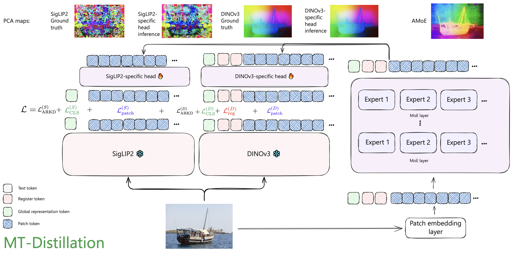

# AMOE: Agglomerative Mixture-of-Experts Vision Foundation Models

[](https://sofianchay.github.io/amoe/)
[](https://arxiv.org/abs/2512.20157)
[-yellow)]()
[-green)]()

A vision encoder distilled from DINOv3 and SigLIP2 teachers, supporting multi-resolution image understanding with Mixture-of-Experts (MoE) architecture.




## Installation

```bash
wget https://github.com/tiiuae/amoe/releases/download/AMoE-checkpoint/amoe_ckpt.pt  
pip install -r requirements.txt
pip install -e .
```

## Quick Start

```python
from amoe import load_amoe_model
from PIL import Image
import torch

# Load model
model, processor = load_amoe_model(
    checkpoint_path="path/to/checkpoint.pt",
    device="cuda",
)
model = model.to(torch.bfloat16)

# Load and preprocess image
image = Image.open("image.jpg")
inputs = processor(image, return_tensors="pt")

# Get features
with torch.no_grad():
    pixel_values = inputs["pixel_values"].to("cuda", dtype=torch.bfloat16)
    spatial_shapes = inputs["spatial_shape"].to("cuda")
    padding_mask = inputs["padding_mask"].to("cuda")
    
    outputs = model(
        pixel_values=pixel_values,
        spatial_shapes=spatial_shapes,
        padding_mask=padding_mask
    )
    
    # DINOv3-style patch features
    patch_features = outputs["output"]["dinov3"]  # (N, L, 1024)
    
    # SigLIP2-style pooled features
    pooled_features = outputs["summary"]["siglip2"]  # (N, 1152)
    
    # Native model features
    amoe_features = outputs["output"]["amoe"]  # (N, L, 768)
```

## PCA Visualization

To visualize the principal components of the features:

```bash
python pca_maps.py \
    --ckpt_path path/to/checkpoint.pt \
    --input_dir path/to/images/ \
    --output_path ./output_viz/ \
    --num_samples 10
```

Sample output:


## Citation

If you use AMoE in your research, please cite:

```bibtex
@article{chaybouti2025amoe,
  title={AMOE: Agglomerative Mixture-of-Experts Vision Foundation Models},
  author={Chaybouti, Sofian and Narayan, Sanath and Dahou, Yasser and Le Khac, Phuc H. and Singh, Ankit and Huynh, Ngoc Dung and Para, Wamiq Reyaz and Kuehne, Hilde and Hacid, Hakim},
  journal={arXiv preprint arXiv:2512.20157},
  year={2025}
}
```